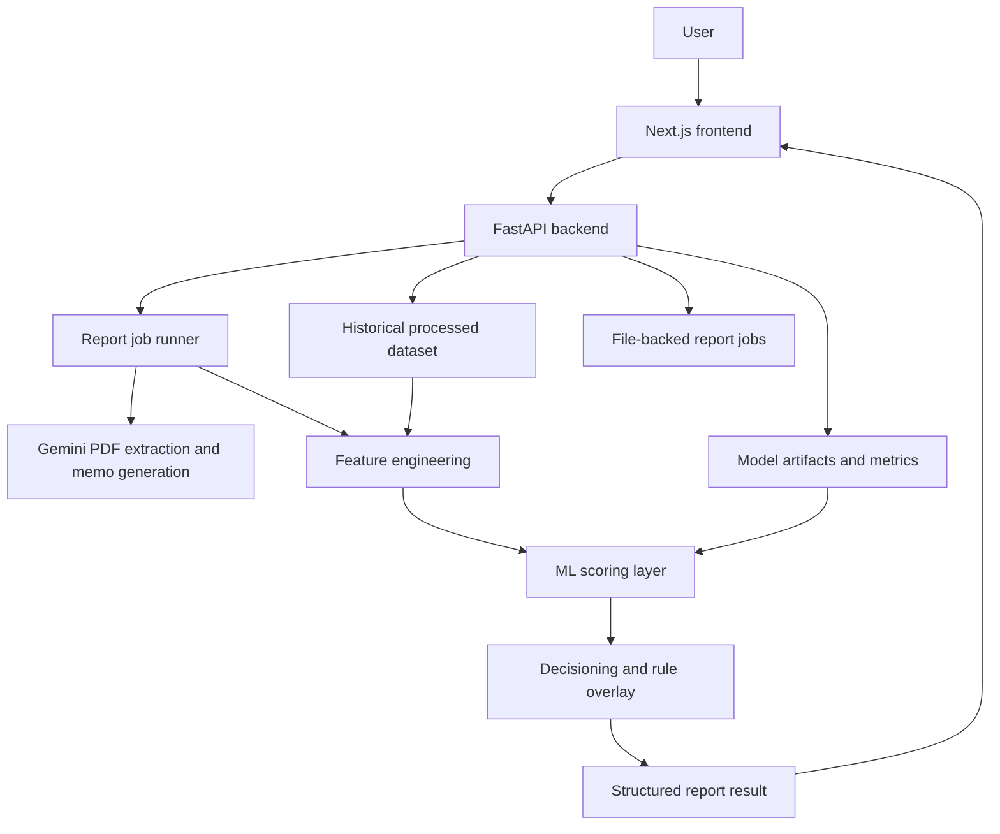
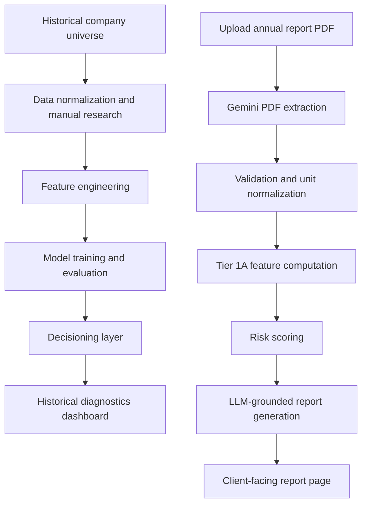
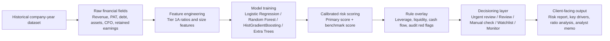

# Fulcrum Work Document

## 1. Executive Summary

Fulcrum is an end-to-end annual-report risk analysis system built for Indian credit-risk workflows. The project started as a data problem: there is no clean, ready-made supervised dataset that maps historical company financials to known wilful-defaulter outcomes in a form suitable for model training. The work therefore had to cover the full stack:

1. identify and assemble a labeled historical universe,
2. normalize and enrich raw financial statement data,
3. engineer a usable feature layer,
4. train and benchmark risk models,
5. add a deterministic rule overlay for operational decisioning,
6. build an upload-to-report product that can analyze a fresh annual report PDF,
7. expose all of it through a FastAPI backend and a client-facing report UI.

The result is not just a model notebook. It is a working system with:

- a historical company-year risk dataset,
- trained ML artifacts,
- decisioning outputs and buckets,
- a file-backed report-processing backend,
- Gemini-powered annual-report extraction,
- grounded LLM report generation,
- a frontend report experience built around an expert user rather than a generic chatbot.

The project now supports two distinct but related modes:

- **historical calibration mode**: a portfolio of known labeled companies used to train and benchmark the model,
- **new-company analysis mode**: upload a fresh annual report PDF, extract facts, compute ratios, run the models, and generate a structured risk report.

The central design principle throughout has been: **deterministic for numbers, model-driven for risk scoring, LLM-assisted for explanation, and evidence-linked wherever possible**.

---

## 2. Problem Statement and Product Objective

### 2.1 The problem

In the Indian credit market, annual-report review is still highly manual. Analysts often work through:

- financial statements,
- notes to accounts,
- audit opinions,
- contingent liabilities,
- promoter holding,
- cash-flow quality,
- leverage,
- liquidity,
- and sector context,

but these are spread across annual reports, exchange filings, public data aggregators, and disclosures that are not normalized for modeling.

The practical problems this project aimed to solve were:

- getting a supervised historical dataset for risk modeling,
- creating a feature layer that is robust enough for financial-risk classification,
- building a usable risk score rather than a one-off model experiment,
- creating a report product that works on a fresh uploaded annual report,
- generating outputs that a risk analyst can actually use.

### 2.2 The product objective

Fulcrum is intended to help an analyst answer:

- How risky does this company look relative to the historical defaulter cohort?
- Which ratios and statement-level signals are driving that view?
- Are there liquidity, leverage, audit, or contingent-liability concerns that justify escalation?
- What should be reviewed next before a credit or risk decision is taken?

The system is therefore designed as a **risk-analysis assistant**, not a generic AI summary tool.

---

## 3. End-to-End Scope of Work Completed

The work completed in this project spans six layers.

### 3.1 Data assembly

- created a labeled company-year dataset,
- sourced known wilful-defaulter names and non-defaulter controls,
- collected and normalized financial statement fields,
- manually backfilled hard-to-get fields from annual reports,
- tracked missingness and coverage.

### 3.2 Feature engineering

- defined a broad financial feature specification,
- engineered a dense Tier 1A feature set for modeling,
- documented formulas and guards,
- handled edge cases like zero denominators and negative equity.

### 3.3 ML pipeline

- built training matrices,
- trained multiple models,
- used grouped splits by company to avoid year-level leakage,
- added calibration,
- produced benchmark reports and feature-importance artifacts.

### 3.4 Decisioning layer

- converted model outputs into workflow buckets,
- combined model signals with deterministic rules,
- added model-alignment checks,
- created historical decisioning outputs for the training universe.

### 3.5 Annual-report analysis backend

- built upload-to-job API flow,
- persisted jobs as JSON artifacts rather than adding database overhead,
- integrated Gemini for PDF extraction,
- validated extracted values,
- computed ratios and scores,
- generated structured report sections.

### 3.6 Frontend report product

- built an upload flow,
- added processing-state streaming,
- created a client-facing report page,
- shifted the report structure toward a memo-style layout rather than dashboard clutter,
- removed internal model/tooling language from client-facing surfaces.

---

## 4. Repository and System Architecture

The current project is organized into the following major areas:

- `frontend/`: Next.js frontend application
- `api/`: FastAPI backend
- `scripts/`: data engineering, model training, scoring, report job runner, Gemini integration
- `config/`: model config, feature spec, risk rules
- `data/`: processed dataset, training matrices, report job storage
- `artifacts/`: trained models, thresholds, metrics, feature importances
- `docs/`: API contract, feature dictionary, data-source notes
- `notebooks/`: exploratory/model workbench notebook

### 4.0 Overall system architecture diagram

### 4.1 Main system flow

### 4.2 Runtime backend flow

1. user uploads a PDF,
2. FastAPI creates a file-backed job,
3. backend sends the PDF to Gemini,
4. extraction results are normalized to INR crore,
5. Tier 1A features are computed,
6. risk models are run,
7. LLM report sections are generated from structured facts,
8. the frontend receives streaming progress and then the final report object.

### 4.3 Storage approach

A deliberate decision was made **not** to introduce a database at this stage.

Each uploaded report job is stored under:

- `data/report_jobs/{job_id}/job.json`
- `data/report_jobs/{job_id}/events.jsonl`
- `data/report_jobs/{job_id}/upload.pdf`
- `data/report_jobs/{job_id}/gemini_extraction.json`
- `data/report_jobs/{job_id}/extracted_model_input.csv`
- `data/report_jobs/{job_id}/result.json`

This was the correct tradeoff because the workflow is job-based, local/dev-friendly, easy to inspect, and does not yet need multi-user persistence or relational querying.

---

## 5. Historical Dataset Construction

## 5.1 Historical universe design

The historical universe is organized at the **company-year** level.

Current dataset shape:

- `data/processed/data.csv`: **300 rows x 35 columns**
- cohorts:
  - `defaulter`: **150 rows**
  - `non_defaulter`: **150 rows**

This corresponds to:

- **100 companies total**,
- approximately **3 annual observations per company**,
- evenly split between the positive and control cohorts.

The latest-year decisioning file confirms the company-level count:

- `data/processed/decisioning_output_latest.csv`: **100 rows**
- latest-company cohort split:
  - `defaulter`: **50**
  - `non_defaulter`: **50**

This structure matters because the modeling problem is not a single-row-per-company classification. It is a **multi-year company panel**, which creates leakage risk if splitting is done incorrectly.

## 5.2 Label sourcing

The defaulter cohort was built from publicly available wilful-defaulter references and associated financial disclosures.

The source strategy documented in `docs/DATA_SOURCES_WILFUL_DEFAULTERS.md` is:

- **CIBIL Suit Filed database** as the main public company-level source trail,
- RBI policy/public references for scheme and context,
- public reported wilful-defaulter lists and references,
- additional publicly available company and filing sources to ground the names.

The core point is that the label layer is built from **known historical outcome cohorts**, not synthetic distress labels.

## 5.3 Financial statement sourcing

The source mapping defined in `config/feature_spec.yaml` documents the intended upstream sources for the historical dataset.

Those sources are:

- Moneycontrol historical financial statement pages,
- annual report PDFs,
- exchange-linked annual report PDFs via BSE/NSE,
- company investor-relations pages,
- annual report notes and shareholding disclosures for audit/governance fields.

In practice, the dataset was built using a hybrid process:

- base statement fields from structured public financial pages where available,
- manual validation and backfilling from annual reports,
- targeted annual-report extraction for hard fields like audit opinion, contingent liabilities, promoter holding, and capex.

## 5.4 Why annual reports mattered

The historical dataset could not be built from only one structured source because several high-signal fields are rarely clean in public tabular aggregators.

The main examples were:

- `opinion_type`
- `auditor_name`
- `contingent_liabilities_amount`
- `promoter_holding_pct`
- `emphasis_of_matter`
- in some cases even `capex`, `cfi`, and `net_cash_change`

That is why a large portion of the preprocessing work involved manual annual-report research and normalization.

---

## 6. Raw Data Schema and Coverage

The raw processed training dataset currently contains 35 columns. The most important fields fall into four groups:

### 6.1 Income statement fields

- `revenue`
- `pat`
- `interest_expense`
- `tax_expense`
- `depreciation`
- `ebitda`

### 6.2 Balance sheet fields

- `total_equity`
- `total_borrowings`
- `total_assets`
- `current_assets`
- `current_liabilities`
- `cash_and_equivalents`
- `inventory`
- `receivables`
- `retained_earnings`

### 6.3 Cash flow fields

- `cfo`
- `cfi`
- `cff`
- `net_cash_change`
- `capex`

### 6.4 Governance and audit fields

- `opinion_type`
- `auditor_name`
- `contingent_liabilities_amount`
- `promoter_holding_pct`
- `emphasis_of_matter`
- `going_concern_uncertainty`
- `fraud_reported`

## 6.5 Coverage profile

A major part of the preprocessing effort was improving coverage in fields that matter to risk analysis but are not cleanly available from public structured sources.

Current non-null counts in `data/processed/data.csv`:

| Field | Non-null rows | Comment |
|---|---:|---|
| `revenue` | 300 | complete |
| `pat` | 300 | complete |
| `interest_expense` | 300 | complete |
| `tax_expense` | 298 | near-complete |
| `depreciation` | 300 | complete |
| `ebitda` | 300 | complete |
| `total_equity` | 300 | complete |
| `total_borrowings` | 300 | complete |
| `total_assets` | 300 | complete |
| `retained_earnings` | 300 | complete |
| `cfo` | 296 | near-complete |
| `cfi` | 296 | near-complete |
| `cff` | 296 | near-complete |
| `net_cash_change` | 296 | near-complete |
| `current_assets` | 143 | incomplete |
| `current_liabilities` | 143 | incomplete |
| `cash_and_equivalents` | 143 | incomplete |
| `inventory` | 143 | incomplete |
| `receivables` | 143 | incomplete |
| `capex` | 117 | sparse |
| `opinion_type` | 117 | sparse |
| `auditor_name` | 117 | sparse |
| `contingent_liabilities_amount` | 140 | incomplete |
| `promoter_holding_pct` | 117 | sparse |
| `emphasis_of_matter` | 41 | very sparse |
| `going_concern_uncertainty` | 4 | very sparse |
| `fraud_reported` | 4 | very sparse |

### 6.6 What this means

The historical dataset is strong enough for a **dense baseline modeling layer** because the core balance-sheet, earnings, and cash-flow fields are mostly complete.

However, it is not yet a complete governance-heavy distress dataset. Audit and governance fields remain much sparser than the core financial variables.

This directly shaped the modeling strategy:

- start with a dense financial feature set,
- add governance and audit fields as overlays where available,
- avoid building the core production model around sparse variables.

---

## 7. Feature Specification and Engineering

## 7.1 Broad feature specification

The full feature specification is documented in `config/feature_spec.yaml`.

It covers:

- profit and loss,
- balance sheet,
- cash flow,
- liquidity ratios,
- leverage ratios,
- profitability ratios,
- efficiency ratios,
- cash-flow metrics,
- growth features,
- temporal features.

The broad feature spec was intentionally larger than what the production model currently uses. The purpose of the spec is to define the analytical universe and keep future feature expansion disciplined.

### 7.1.1 Main raw feature groups

The major raw and derived areas defined in the spec are:

- **profit and loss**: revenue, PAT, interest expense, depreciation, EBITDA, tax expense
- **balance sheet**: total equity, total borrowings, current assets, current liabilities, total assets, cash, inventory, receivables, retained earnings
- **cash flow**: CFO, CFI, CFF, net cash change, capex
- **liquidity ratios**: current ratio, quick ratio, cash ratio
- **leverage ratios**: debt/equity, interest coverage, debt service coverage
- **profitability ratios**: net margin, ROA, ROE
- **efficiency ratios**: asset turnover, receivables turnover
- **cash-flow metrics**: CFO/revenue, free cash flow, cash flow to debt, CFO/PAT
- **growth and temporal features**: YoY changes, trends, and volatility

## 7.2 Tier 1A: the production baseline feature set

The production modeling layer was narrowed to a dense baseline set because coverage quality matters more than feature count.

The selected Tier 1A features are:

- `debt_to_assets`
- `ebitda_margin`
- `pat_margin`
- `roa`
- `retained_earnings_to_assets`
- `cfo_to_assets`
- `cfo_to_ebitda`
- `net_cash_change_to_assets`
- `log_total_assets`
- `log_revenue`

These are defined in:

- `docs/TIER1_FEATURE_DICTIONARY.md`
- `config/model_train_config_tier1a.yaml`

### 7.2.1 Tier 1A formulas

| Feature | Formula |
|---|---|
| `debt_to_assets` | `total_borrowings / total_assets` |
| `ebitda_margin` | `ebitda / revenue` |
| `pat_margin` | `pat / revenue` |
| `roa` | `pat / total_assets` |
| `retained_earnings_to_assets` | `retained_earnings / total_assets` |
| `cfo_to_assets` | `cfo / total_assets` |
| `cfo_to_ebitda` | `cfo / ebitda` |
| `net_cash_change_to_assets` | `net_cash_change / total_assets` |
| `log_total_assets` | `ln(total_assets)` |
| `log_revenue` | `ln(revenue)` |

### 7.2.2 Engineering rules

The feature dictionary also documents the core engineering guards:

- denominator guard for zero or missing denominators,
- positive-denominator guard where required,
- log features only on strictly positive values,
- YoY growth only when a valid prior-year value exists.

These guards were necessary because company distress data has common pathologies:

- zero or near-zero equity,
- negative profitability,
- missing prior-year values,
- partial cash-flow reporting,
- sign inconsistency in extracted numbers.

## 7.3 Tier 1A coverage quality

Coverage in `data/processed/training_matrix_tier1a.csv` is strong enough for production baseline modeling.

Current non-null counts:

| Feature | Non-null rows |
|---|---:|
| `debt_to_assets` | 300 |
| `ebitda_margin` | 300 |
| `pat_margin` | 300 |
| `roa` | 300 |
| `retained_earnings_to_assets` | 300 |
| `cfo_to_assets` | 296 |
| `cfo_to_ebitda` | 296 |
| `net_cash_change_to_assets` | 296 |
| `log_total_assets` | 300 |
| `log_revenue` | 300 |

This is exactly why Tier 1A became the production feature contract: it gives dense coverage without depending on sparse governance fields.

## 7.4 Why we did not push everything into the first model

Several additional features were considered important analytically, but not strong enough operationally for the first production model because of missingness or comparability issues.

Examples:

- `current_ratio`
- `cash_ratio`
- `receivables_to_revenue`
- `inventory_to_revenue`
- `capex_to_assets`
- `qualified_opinion_flag`
- `promoter_holding_pct`
- `contingent_liabilities_to_assets`

These remain important for report interpretation and future model versions, but they were not the right basis for the first dense production model.

---

## 8. Data Pitfalls and Preprocessing Challenges

A large share of the project effort was not model training. It was getting the data into a state where training was even defensible.

## 8.1 Standalone vs consolidated basis

This was one of the most recurring issues.

Annual reports and public data sources often provide both:

- standalone financials,
- consolidated financials.

They are not interchangeable. If one year is standalone and the next is consolidated, ratios become misleading and time-series changes become meaningless.

### Mitigation

- use standalone where possible for comparability,
- explicitly track basis,
- fall back to consolidated only where required,
- surface basis caveats in the report pipeline.

## 8.2 Unit inconsistency

Annual reports use varying monetary bases:

- crore,
- lakh,
- million,
- thousand,
- sometimes rupees without clear scale.

If the system silently mixes these, the model and ratios become useless.

### Mitigation

- normalize amounts to INR crore,
- preserve raw values and source-scale metadata,
- flag low-confidence unit detection,
- avoid silent normalization without warnings.

## 8.3 Sign conventions

Cash-flow fields are especially messy across documents and structured sources.

Examples:

- capex may appear as a negative outflow,
- net investing cash flow may be used as a capex proxy,
- debt repayment can invert interpretation in financing cash flow,
- extracted values may need normalization to analysis-friendly definitions.

### Mitigation

- normalize capex conventions explicitly,
- keep warnings in validation issues,
- distinguish raw source value from normalized analytical value.

## 8.4 Sparse governance fields

High-signal qualitative fields are the hardest to collect systematically.

Examples:

- audit qualification,
- emphasis of matter,
- going-concern warnings,
- fraud reporting,
- promoter holding,
- quantified contingent liabilities.

### Mitigation

- do not make the baseline model depend on them,
- include them in broader feature spec and report layer,
- keep them available for rule overlays and future versions.

## 8.5 Small dataset problem

The dataset is useful, but still small by ML standards:

- 100 companies,
- 300 company-year rows,
- 50/50 company-level class balance.

This is enough for careful tabular modeling, but not enough for careless feature proliferation or deep-learning-style experimentation.

### Mitigation

- keep baseline feature set compact,
- use grouped splits,
- calibrate probabilities,
- retain an interpretable benchmark model,
- avoid overclaiming generalizability.

## 8.6 Labeling limitation: static cohort vs event timing

The current target is cohort-based, not yet a true forward event-time label.

That means the current model answers something closer to:

- “How much does this company-year resemble the historical wilful-defaulter cohort?”

rather than:

- “What is the probability of default within the next 12 months?”

### Implication

The current system is useful for **screening and prioritization**, but it is not yet a fully event-timed credit-risk model.

---

## 9. Model Development Strategy

## 9.1 Initial model stack considered

The project initially considered a broader model stack:

- rule-based scorecard,
- logistic regression,
- gradient-boosted trees,
- anomaly detection,
- clustering / peer grouping.

That remains the broader conceptual architecture.

## 9.2 What was actually productionized

The formal supervised training pipeline currently includes four models:

- `logistic_regression`
- `random_forest`
- `hist_gradient_boosting`
- `extra_trees`

These are defined and trained through `scripts/train_models.py` and configured via `config/model_train_config_tier1a.yaml`.

The anomaly/clustering layer was useful conceptually and in notebook thinking, but it is not currently part of the production scoring/export path.

## 9.3 The exact ML question we are answering

Before discussing the models, it is important to frame the prediction problem correctly.

The current ML setup does **not** attempt to forecast an exact future default date. Instead, it learns from a historical labeled cohort and answers a more practical first-stage question:

- does this company-year financially resemble historically risky or wilful-defaulter cases?

That means the model is acting as a **risk-pattern recognizer**. It is especially useful for:

- early screening,
- prioritization,
- escalation,
- first-pass analyst review.

This framing is important because it explains both the value and the limit of the current system. The value is that it can surface risk patterns from annual-report data. The limit is that it is not yet a fully forward-timed probability-of-default model.

## 9.4 Why these models were chosen

### Logistic regression

Chosen because it is:

- interpretable,
- stable,
- appropriate for small tabular datasets,
- a good audit benchmark,
- easy to calibrate and explain.

### Random forest

Chosen because it is:

- robust on tabular data,
- good at capturing nonlinear interactions,
- relatively stable with moderate tuning,
- a strong challenger to the linear baseline.

### HistGradientBoosting

Chosen because it is:

- strong on structured tabular problems,
- efficient,
- often better than bagged trees when nonlinear separation matters,
- capable of producing better discriminative performance than simpler models.

### Extra Trees

Chosen because it is:

- a strong tabular ensemble baseline,
- useful to test whether more randomized tree structure improves separation,
- a good challenger to both random forest and boosting.

## 9.5 Why not deep learning

Deep learning was deliberately not used.

Reasons:

- the dataset is too small,
- the inputs are structured tabular finance features,
- explainability matters,
- the bottleneck is data quality and target design, not representation learning.

That was the correct call.

---

## 10. Model Training Methodology

## 10.1 Training configuration

The production Tier 1A training config is in `config/model_train_config_tier1a.yaml`.

Key design choices:

- **label column**: `target_wilful_default`
- **categorical column**: `sector`
- **numeric imputer**: median
- **correlation threshold**: 0.90
- **train / validation / test company split**: 70 / 15 / 15
- **random seed**: 42
- **threshold sweep**: 0.10 to 0.90 in 0.01 steps
- **target recall**: 0.75
- **probability calibration**: sigmoid
- **cross-validation**: 5-fold grouped CV

## 10.2 Company-grouped split

This is a critical design point.

Because the dataset contains multiple years per company, a naive row-level random split would leak company identity across train and test.

That would inflate performance because the model would effectively see near-duplicate company structure in training and testing.

### Mitigation

The training pipeline uses grouped splitting by company:

- `StratifiedGroupKFold`
- grouped train/validation/test splitting by company

This is the correct approach for panel-style company-year risk data.

## 10.3 Why grouped training matters for this project

This is one of the most important decisions on the ML side.

If the same company appears in:

- training for one year,
- and testing for another year,

the model can partially memorize company structure rather than learning true risk patterns. In a small multi-year corporate dataset, that would create misleadingly strong test metrics.

Using grouped company splits forces the model to generalize to **unseen companies**, which is much closer to the real product use case: a user uploads a new company’s annual report, and the model has to reason from financial structure rather than identity.

## 10.4 Preprocessing stack

The ML pipeline in `scripts/train_models.py` uses:

- `SimpleImputer` for numeric median imputation,
- `StandardScaler` where appropriate,
- `OneHotEncoder` for sector,
- model-specific estimators,
- probability calibration through sigmoid or isotonic options.

The current production calibration method is **sigmoid**.

## 10.5 Threshold selection and operating posture

The model is not used as a pure probability output alone. It has to operate inside a risk workflow.

That is why the training config includes:

- threshold sweep from `0.10` to `0.90`,
- step size of `0.01`,
- target recall of `0.75`.

This reflects an operational choice: in risk screening, missing truly risky names is costly, so recall matters. At the same time, too many false alarms would make the system unusable. The threshold search is therefore a practical part of the product design, not just a modeling detail.

## 10.6 Why calibration matters

Raw classifier probabilities are often poorly calibrated, especially on small datasets.

Because Fulcrum uses scores for workflow and client-facing interpretation, a badly calibrated probability would be misleading even if ranking performance is acceptable.

That is why calibration is part of the formal training configuration and persisted production bundle.

## 10.7 What each model contributes

The four trained models are not useful in exactly the same way.

### Logistic regression

Role:

- benchmark / audit model
- interpretability anchor
- sanity check against more complex models

Why it matters:

- easy to explain,
- helps show which financial variables push risk up or down,
- useful when assessing whether the primary engine is behaving reasonably.

### Random forest

Role:

- strong nonlinear baseline
- good general-purpose tabular classifier

Why it matters:

- captures interactions that a linear model cannot,
- often performs well when several medium-strength features combine into a stronger signal.

### HistGradientBoosting

Role:

- primary production engine

Why it matters:

- strongest overall operating balance in this project,
- good at learning structured nonlinear financial relationships,
- strongest final production choice on the current dataset.

### Extra Trees

Role:

- high-variance challenger model

Why it matters:

- useful to test whether more randomized trees improve ranking,
- strong in some AUC metrics,
- helpful as a benchmark even though it was not chosen for production.

---

## 11. Model Evaluation and Benchmarking

## 11.1 Grouped cross-validation results

Grouped cross-validation summary from `artifacts/reports/grouped_cv_summary.csv`:

| Model | ROC-AUC mean | PR-AUC mean | F1 mean | Brier mean |
|---|---:|---:|---:|---:|
| logistic_regression | 0.8973 | 0.9177 | 0.7675 | 0.1603 |
| random_forest | 0.9040 | 0.9171 | 0.8220 | 0.1592 |
| hist_gradient_boosting | 0.9073 | 0.9221 | 0.7918 | 0.1682 |
| extra_trees | 0.9158 | 0.9264 | 0.7233 | 0.1579 |

### Interpretation

- `extra_trees` achieved the best grouped CV AUC metrics, but its F1 was materially weaker and less stable.
- `random_forest` had strong F1 and solid AUC.
- `hist_gradient_boosting` had the best PR-AUC among the more stable contenders and remained competitive across metrics.
- `logistic_regression` remained strong enough to justify keeping it as the audit/benchmark model.

## 11.2 Holdout leaderboard

Holdout results from `artifacts/reports/model_leaderboard.csv`:

| Model | Threshold | Calibration | Test PR-AUC | Test ROC-AUC | Test Brier | Test F1 |
|---|---:|---|---:|---:|---:|---:|
| logistic_regression | 0.42 | sigmoid | 0.9147 | 0.8790 | 0.1516 | 0.8421 |
| random_forest | 0.53 | sigmoid | 0.9594 | 0.9524 | 0.1698 | 0.8421 |
| hist_gradient_boosting | 0.40 | sigmoid | 0.9480 | 0.9246 | 0.1337 | 0.8837 |
| extra_trees | 0.47 | sigmoid | 0.8653 | 0.8909 | 0.1834 | 0.8444 |

### Interpretation

The holdout results drove the final production posture:

- `hist_gradient_boosting` produced the best **overall operating balance**,
- it had the strongest **test F1**,
- it had the best **test Brier score**, which matters because the system surfaces probability-like risk outputs,
- it remained strong on discrimination metrics,
- `logistic_regression` remained the most defensible audit baseline.

## 11.3 How to read the metrics in context

The metrics are good enough to justify productization, but they need to be interpreted correctly.

### ROC-AUC

This tells us how well the model separates the two classes overall across thresholds.

In this project, ROC-AUC around `0.88` to `0.95` on holdout is a strong sign that the models are learning real structure rather than random noise.

### PR-AUC

This is especially useful when thinking in terms of identifying risky names well. It matters because the product is more concerned with surfacing meaningful high-risk cases than with optimizing a generic balanced-class score alone.

### F1

F1 matters because the product eventually takes action-like decisions, not just rankings. The best holdout F1 came from `hist_gradient_boosting` at about `0.884`, which is one of the main reasons it was selected as the primary engine.

### Brier score

This matters because Fulcrum exposes score-like outputs that users interpret as risk intensity. A better Brier score means the model’s probabilities are more trustworthy. This is why `hist_gradient_boosting` stood out operationally.

## 11.4 Production model decision

Current production manifest in `artifacts/models/production_model.json`:

- production model: `hist_gradient_boosting`
- model version: `tier1a_v1`
- calibration method: `sigmoid`

This was the correct production choice because it best balanced discrimination and calibration on the current problem.

## 11.5 Why logistic regression remains important

Even though it is not the primary engine, logistic regression remains critical because it gives:

- interpretable directionality,
- a sanity check against the tree model,
- disagreement signals that help route cases to `manual_check`,
- an audit baseline that is easier to explain to stakeholders.

---

## 12. What the Models Learned

The model artifacts show a fairly coherent signal story.

## 12.1 Logistic regression coefficients

Top coefficient magnitudes from `artifacts/reports/logistic_regression_coefficients.csv` include:

- `debt_to_assets`
- `roa`
- `log_revenue`
- multiple sector effects

Interpretation:

- higher leverage intensity increases risk,
- stronger returns on assets reduce risk,
- company scale matters,
- sector matters enough to justify explicit sector encoding.

## 12.2 Tree feature importances

Top random forest importance values from `artifacts/reports/random_forest_feature_importance.csv`:

- `debt_to_assets`
- `roa`
- `cfo_to_assets`
- `ebitda_margin`
- `log_revenue`
- `log_total_assets`
- `cfo_to_ebitda`
- `net_cash_change_to_assets`

Top extra-trees importances similarly emphasize:

- `debt_to_assets`
- `log_revenue`
- `roa`
- `log_total_assets`
- `cfo_to_assets`

### Interpretation

Across models, the most stable signals are:

- leverage intensity,
- profitability quality,
- cash-generation quality,
- company scale.

This is exactly what we would expect from a first-generation financial distress model built on annual-report data.

## 12.3 What this means in business terms

The model is effectively learning a financially intuitive story:

- companies with more debt relative to assets tend to look riskier,
- companies with weak returns on assets tend to look riskier,
- companies whose operating cash flow does not support the asset base tend to look riskier,
- companies whose EBITDA does not convert to cash tend to look riskier,
- companies with weak retained-earnings support tend to look more fragile.

So even though the system is ML-driven, the signal structure is not arbitrary. It is learning patterns that align with how an experienced risk analyst would think about leverage, profitability, and cash-flow quality.

## 12.4 Why sector still matters

Sector is not the dominant signal, but it is not negligible either.

That is financially reasonable because:

- leverage norms differ across sectors,
- asset intensity differs across sectors,
- working-capital structures differ across sectors,
- distress patterns do not look identical in infrastructure, NBFC, manufacturing, pharma, or travel.

Including sector improves the realism of the model even when the primary signal still comes from the financial ratios.

---

## 13. Decisioning Layer and Risk Workflow

The trained models are not the final product by themselves. A separate decisioning layer converts raw scores into workflow outputs.

## 13.1 Why a decisioning layer was needed

A raw probability is not enough for analyst operations. Users need:

- action buckets,
- disagreement handling,
- reasons,
- percentile context,
- workflow priority.

That is why Fulcrum adds a deterministic decisioning layer on top of model scores.

## 13.2 Rule layer

The rule definitions live in `config/risk_rules.yaml`.

### Critical rules currently include

- weak interest coverage
- excessive leverage
- weak liquidity
- negative operating cash flow
- negative profit margin
- qualified audit signal
- going-concern warning
- large contingent liabilities relative to net worth

### Trend rules include

- declining revenue trend
- declining cash-flow trend
- rising borrowings trend
- leverage spike
- margin deterioration

These rules are not substitutes for the model. They are an operational overlay that improves interpretability and routing.

## 13.3 Decision bucket logic

The bucket logic is implemented in `scripts/build_decisioning_output.py`.

Current bucket semantics:

- `urgent_review`
- `review`
- `manual_check`
- `watchlist`
- `monitor`

The logic combines:

- primary model class,
- benchmark model class,
- rule-flag count,
- critical-rule count,
- model disagreement,
- imputation burden,
- engine/audit score gap.

### Simplified policy

- both models positive + strong rule support -> `urgent_review`
- disagreement or high imputation burden -> `manual_check`
- one strong positive path with support -> `review`
- weaker but non-clean signal -> `watchlist`
- otherwise -> `monitor`

## 13.4 Historical decisioning outputs

Current latest-company decision mix from `data/processed/decisioning_output_latest.csv`:

| Bucket | Count |
|---|---:|
| `urgent_review` | 43 |
| `monitor` | 24 |
| `watchlist` | 19 |
| `manual_check` | 8 |
| `review` | 6 |

Year-level distribution in `data/processed/decisioning_output_years.csv`:

| Bucket | Count |
|---|---:|
| `urgent_review` | 115 |
| `monitor` | 70 |
| `watchlist` | 51 |
| `manual_check` | 39 |
| `review` | 25 |

These files are the calibration layer behind the `/fulcrum` diagnostics surface.

## 13.5 Output fields created by the decisioning layer

The decisioning output includes fields such as:

- risk probability,
- risk score,
- benchmark score,
- decision bucket,
- model alignment,
- rule flag count,
- critical rule count,
- percentile ranking,
- top reasons,
- support summary.

This is what turns the model into an operational risk system rather than a notebook metric.

## 13.6 How the models improve risk assessment in practice

The models improve risk assessment in four concrete ways.

### 1. They combine signals better than single-ratio rules

A company may not look obviously distressed on any single metric, but a model can detect a risky combination such as:

- elevated leverage,
- weakening profitability,
- weak operating cash flow,
- low retained earnings support.

That is much more useful than saying only “debt is high” or “margin is weak.”

### 2. They turn statements into a comparable score

Without the model, annual-report review remains highly qualitative and difficult to compare across companies. The ML layer converts the extracted facts into a comparable risk signal across names and years.

### 3. They support triage

The point is not just to predict. It is to route attention. The system helps separate:

- cases that need immediate escalation,
- cases that need review,
- cases with mixed evidence,
- cases that can remain on watch.

### 4. They make the report more actionable

Because the model sits underneath the report, the generated output is not just a summary of financial statements. It is an analytical assessment informed by learned risk patterns from the historical cohort.

## 13.7 Why we use both a primary model and a benchmark model

The benchmark model improves trust.

If both models broadly agree, confidence in the direction of the signal improves. If they disagree, that itself becomes useful information and can trigger `manual_check`.

This is especially important in a product like Fulcrum because the goal is not to hide uncertainty. The goal is to surface it in a usable way.

---

## 14. The Risk Analysis Model in Practice

The core risk analysis process in Fulcrum is best understood as a layered system.

### 14.0 ML workflow diagram

## 14.1 Layer 1: facts

At the bottom are extracted or historical financial facts:

- revenue,
- borrowings,
- assets,
- equity,
- cash flow,
- working-capital fields,
- audit/gov signals where available.

## 14.2 Layer 2: ratios

Those facts are converted into analytical signals:

- leverage,
- margin,
- returns,
- cash conversion,
- retained earnings support,
- liquidity and working-capital strain.

## 14.3 Layer 3: model scoring

The model estimates how much the company-year resembles the historical wilful-defaulter cohort.

## 14.4 Layer 4: benchmark model

An audit/benchmark model provides an independent second view.

## 14.5 Layer 5: rules

Rules capture obvious red flags that should influence routing even when the pure model score is borderline.

## 14.6 Layer 6: decisioning

The system maps the combined evidence to a workflow bucket.

## 14.7 Layer 7: report generation

The report then synthesizes this into human-readable analysis with evidence references.

This layered design is important because it prevents the product from becoming either:

- a black-box model with no analyst trust, or
- a generic LLM summary with no numeric rigor.

## 14.8 The simplest way to describe the ML layer

If the ML layer had to be described plainly, it would be:

- we trained models on a historical set of risky and non-risky companies,
- the models learned which financial patterns tend to be associated with the risky group,
- we now use those learned patterns to assess a newly uploaded company report,
- and we combine that with rule-based red flags and narrative explanation to produce a practical risk view.

That is the core of how the ML side supports the end product.

## 14.9 Current limitations of the ML layer

The current ML stack is useful, but it has clear boundaries:

- the target is cohort-based rather than time-to-event,
- the dataset is still relatively small,
- some governance fields remain sparse,
- performance is good enough for screening and review, but should not be overclaimed as a full credit-default forecasting engine.

This is why the project frames the system as a **risk analysis and escalation tool**, not as a final autonomous credit-decision model.

---

## 15. Annual Report Ingestion and Analysis Pipeline

The second major product surface is the upload-to-report workflow.

### 15.0 Annual report upload pipeline diagram

## 15.1 Why this pipeline exists

The historical model is only useful if it can be applied to fresh company data. The annual-report pipeline is how that happens.

## 15.2 API contract

The report workflow is formally documented in `docs/ANNUAL_REPORT_API_CONTRACT.md`.

Main report endpoints:

- `POST /reports/upload`
- `GET /reports/{job_id}/status`
- `GET /reports/{job_id}/events`
- `GET /reports/{job_id}`
- `GET /reports/{job_id}/sections`
- `GET /reports/{job_id}/evidence`
- `GET /reports/{job_id}/features`
- `GET /reports/{job_id}/decision`
- `DELETE /reports/{job_id}`

## 15.3 Report job lifecycle

Runtime status flow:

- `queued`
- `parsing`
- `extracting`
- `validating`
- `featurizing`
- `scoring`
- `generating`
- `completed`
- `failed`

## 15.4 Streaming progress design

The system streams job events over Server-Sent Events so the frontend can progressively show:

- upload accepted,
- parsing,
- extraction,
- validation,
- ratios,
- scoring,
- report generation,
- completion.

This creates a much better UX than a blocking spinner, especially because Gemini PDF extraction can take time.

---

## 16. Gemini-Based PDF Extraction

## 16.1 Why Gemini was chosen

The uploaded annual report is a PDF with:

- text,
- tables,
- statement layouts,
- notes to accounts,
- audit sections,
- shareholding disclosures.

This is a document-understanding problem, not a plain CSV ingestion problem.

Gemini was integrated because it can:

- handle PDF uploads via Files API,
- extract structured information from long financial documents,
- return JSON-like output with source references,
- support both extraction and grounded report synthesis.

## 16.2 What Gemini does in Fulcrum

Server-side Gemini is used for:

- extracting raw annual-report fields,
- detecting reporting basis and unit scale,
- inferring sector from the annual report itself,
- generating structured memo sections from validated context.

Gemini is **not** used for:

- final arithmetic,
- ratio computation,
- model scoring,
- decision-bucket assignment.

That split is deliberate and correct.

## 16.3 Extracted fields in V1

The annual-report extractor is designed to return, at minimum:

- revenue
- PAT
- interest expense
- depreciation
- tax expense
- EBITDA
- total equity
- total borrowings
- total assets
- retained earnings
- CFO
- CFI
- CFF
- net cash change
- current assets
- current liabilities
- cash and equivalents
- inventory
- receivables
- capex
- opinion type
- auditor name
- emphasis of matter
- contingent liabilities amount
- promoter holding percentage

Each extraction carries:

- raw value,
- normalized value,
- unit,
- scale,
- period,
- basis,
- confidence,
- source references,
- warnings.

## 16.4 Source-grounding approach

Each field can include source references such as:

- page number,
- snippet,
- table identifier,
- source id.

This is essential for auditability and future evidence UX.

---

## 17. Validation and Normalization in the Report Pipeline

Annual-report extraction cannot be used raw. Validation and normalization are part of the core logic.

## 17.1 Validation tasks

The report job runner performs validation around:

- unit scale,
- reporting basis,
- missing key fields,
- sign normalization,
- extracted-value plausibility.

## 17.2 Normalization tasks

Normalized analytical amounts are converted to **INR crore** for modeling and report consistency.

The system also retains raw/source metadata so normalization is traceable.

## 17.3 Why this is important

Without this stage, the model would be vulnerable to:

- lakh/crore mismatches,
- wrong capex sign,
- standalone/consolidated mixing,
- extracted-but-unusable raw text values.

---

## 18. Financial Ratios and Analytical Views Used in the Report Product

The report product is not just a model output page. It is intended to surface the analytical lenses a risk analyst would actually care about.

## 18.1 Core model ratios shown in the report

The report computes and surfaces the Tier 1A analytical core:

- debt to assets,
- EBITDA margin,
- PAT margin,
- ROA,
- retained earnings to assets,
- CFO to assets,
- CFO to EBITDA,
- net cash change to assets,
- size normalization context.

## 18.2 Supplementary analytical ratios

The report also uses supplementary ratios where extraction quality allows, such as:

- current ratio,
- cash ratio,
- working capital to assets,
- contingent liabilities to assets,
- EBITDA to interest.

These are especially useful for **human interpretation**, even where they are not part of the Tier 1A scoring contract.

## 18.3 Analytical categories used in the report

The report is intended to analyze the company through the following lenses:

### Balance-sheet risk

- borrowings relative to assets,
- equity buffer,
- retained earnings support,
- structural leverage quality.

### Liquidity and cash flow

- short-term liquidity,
- cash conversion,
- net cash movement,
- whether operating cash flow supports the asset base.

### Profitability and asset quality

- revenue base,
- EBITDA margin,
- PAT margin,
- ROA,
- whether current profitability offsets leverage or liquidity pressure.

### Governance and audit

- opinion type,
- auditor,
- emphasis of matter,
- going-concern signals,
- promoter holding,
- contingent liabilities.

### Risk summary

- model score,
- benchmark score,
- decision bucket,
- key drivers,
- analyst recommendation.

---

## 19. Sector Handling and Benchmarking

Sector matters in this product in two different ways.

## 19.1 Historical modeling

In the training pipeline, `sector` is explicitly included as a categorical model input. This matters because leverage, profitability, and asset intensity differ structurally by sector.

## 19.2 Uploaded annual report workflow

For a fresh PDF upload, the company should not be matched to the historical training-company identities. The training set exists to teach the model patterns, not to resolve identity for new uploads.

The current sector approach is therefore:

- detect sector from the uploaded annual report via Gemini,
- map free-text descriptions into a controlled taxonomy where possible,
- fall back to unresolved status when confidence is insufficient.

This is the right design because it avoids accidental identity leakage from the training cohort into the uploaded-company workflow.

## 19.3 Benchmarking usage

Sector benchmarking is used in three ways across the system:

- as an explicit training feature,
- as part of decisioning context and percentiles,
- as narrative context in the report.

A future improvement would be to formalize sector-specific ratio standards in backend policy rather than keeping them as UI-level heuristics.

---

## 20. Report Generation and Client-Facing Output

## 20.1 Initial report approach

The initial report product started from the pipeline and model outputs, but early iterations leaned too much toward engineering-style surfaces:

- too many boxes,
- too much internal/system language,
- too much workflow scaffolding visible to the end user,
- not enough balanced report structure.

## 20.2 Corrected report direction

The report has been moving toward a client-facing memo structure.

Current report sections are designed around:

- company profile,
- model verdict,
- balance-sheet risk,
- liquidity and cash flow,
- profitability and asset quality,
- governance and audit,
- key red flags,
- what could change the view,
- analyst conclusion.

This is closer to how a risk analyst or client would want to read the output.

## 20.3 What the report provides

The report now aims to provide:

- a structured written risk view,
- extracted financial context,
- ratio interpretation,
- key red flags,
- a final assessment summary,
- access to raw statements where needed,
- report caveats where the extraction or evidence is weak.

## 20.4 Important client-facing changes made

During product refinement, the report surface was adjusted to remove or reduce:

- internal model names on the client side,
- taxonomy-resolution or confidence jargon,
- process notes that are useful for debugging but not for a delivered report,
- engineering provenance tags like `llm_synthesized` or `model_derived`,
- overuse of crowded cards and fragmented UI blocks.

This matters because the product is meant to read like a professional analytical report, not a developer console.

---

## 21. Historical Diagnostics Surface

The `/fulcrum` page is not intended as a client search interface over the training cohort. The historical company dataset is primarily a calibration set.

The more useful use of this page is as a diagnostics surface that helps answer:

- how the model scores are distributed,
- how many names fall into each bucket,
- how clearly the model separates the two historical cohorts,
- which reasons surface most often,
- how sectors differ in average score and escalation rate.

This is important because it helps interpret a new uploaded company in context, even though the uploaded company is not meant to be matched to the historical identity layer.

---

## 22. What Was Hard About This Project

A project like this looks simple in presentation form, but the hard parts are not where most people initially expect.

## 22.1 Hard part 1: building the dataset

The biggest early bottleneck was not modeling. It was assembling and cleaning the data.

That included:

- identifying company cohorts,
- collecting multiple years,
- finding annual reports,
- reconciling unit scales,
- deciding standalone vs consolidated basis,
- manually backfilling sparse audit/governance fields,
- fixing shifted or misaligned values in raw CSV rows.

## 22.2 Hard part 2: preserving comparability

Financial statement data across public sources is not plug-and-play.

Every field needs comparability rules:

- what to do with zero or negative equity,
- whether to use absolute capex,
- how to compute EBITDA if not reported,
- whether to carry forward a basis decision,
- how to handle old GAAP vs Ind AS transitions.

## 22.3 Hard part 3: avoiding overengineering

It would have been easy to overbuild:

- too many sparse features,
- too many model types,
- too much frontend surface before backend rigor,
- too much LLM responsibility.

Instead, the system was narrowed around a dense feature core and a disciplined division of labor.

## 22.4 Hard part 4: making the report credible

The report page had to become:

- less like a developer demo,
- less like a generic AI card dashboard,
- more like a real client-facing analytical memo.

That is a product-design problem, not just a frontend problem.

---

## 23. Known Limitations

The system is materially useful now, but several limitations remain.

## 23.1 Target design is still cohort-based

The biggest modeling limitation is that the current label is based on cohort membership rather than a fully event-timed forward default target.

What we have now is good for:

- distress resemblance,
- screening,
- triage,
- escalation.

What it is not yet is a true probability-of-default-within-horizon model.

## 23.2 Audit/governance fields remain sparse historically

The training dataset is still much stronger on financial statement variables than on audit/governance variables.

## 23.3 Sector benchmarking is still evolving

Sector is included, but sector-specific standards and benchmarking policies are not yet fully formalized as a backend policy layer.

## 23.4 Report evidence UX can go further

The backend already carries source references, but the client-facing evidence experience can still be improved so every memo section is directly explorable.

## 23.5 Uploaded-report extraction quality still depends on document quality

The PDF pipeline is real, but extraction quality depends heavily on:

- scan quality,
- text layer quality,
- table formatting,
- clarity of annual report notes.

That is an unavoidable constraint.

---

## 24. Why the Current Product Is Still Valuable

Despite the limitations, the current system already does several things well.

It can:

- take a raw annual report PDF,
- extract relevant financial and audit facts,
- normalize them for analysis,
- compute a compact but defensible financial-risk feature set,
- score them against a historical wilful-defaulter model,
- route the case into an action bucket,
- produce a client-facing risk memo.

That is already a significant compression of analyst effort.

Even before the label layer evolves into event-time prediction, Fulcrum is useful as:

- a first-pass analyst copilot,
- a screening and prioritization tool,
- a report-generation layer for expert review,
- a calibration system for understanding model behavior on historical cases.

---

## 25. Recommended Next Steps

The right next steps are not “more random features” or “more models.” The next steps should be disciplined.

## 25.1 Data and labeling

- add event timing to the defaulter cohort,
- define `default within 1y / 2y / 3y` targets,
- continue improving sparse audit/governance fields selectively.

## 25.2 Modeling

- keep Tier 1A as the baseline contract,
- add future versions only through controlled ablation,
- evaluate sector-conditional benchmark policies,
- keep the audit benchmark model alongside the primary engine.

## 25.3 Product and report

- improve evidence UX so memo claims are directly inspectable,
- add exportable report formats,
- refine client-facing wording further,
- make sector resolution and caveats more gracefully surfaced.

## 25.4 Operations

- formalize report-quality scoring,
- add monitoring for extraction failures and low-confidence jobs,
- version report templates and ratio-interpretation policies.

---

## 26. Key Files and Artifacts

### 26.1 Data

- `data/processed/data.csv`
- `data/processed/model_features.csv`
- `data/processed/training_matrix_tier1a.csv`
- `data/processed/decisioning_output_latest.csv`
- `data/processed/decisioning_output_years.csv`

### 26.2 Config

- `config/feature_spec.yaml`
- `config/model_train_config_tier1a.yaml`
- `config/risk_rules.yaml`

### 26.3 Training and scoring scripts

- `scripts/build_model_features.py`
- `scripts/build_training_matrix.py`
- `scripts/train_models.py`
- `scripts/scoring_utils.py`
- `scripts/build_decisioning_output.py`

### 26.4 Annual report analysis

- `scripts/report_job_runner.py`
- `scripts/gemini_report_extractor.py`
- `api/predict.py`
- `docs/ANNUAL_REPORT_API_CONTRACT.md`

### 26.5 Documentation and notebook

- `docs/TIER1_FEATURE_DICTIONARY.md`
- `docs/DATA_SOURCES_WILFUL_DEFAULTERS.md`
- `notebooks/tier1a_model_workbench.ipynb`

### 26.6 Model artifacts and evaluation reports

- `artifacts/models/production_model.json`
- `artifacts/reports/grouped_cv_summary.csv`
- `artifacts/reports/model_leaderboard.csv`
- `artifacts/reports/logistic_regression_coefficients.csv`
- `artifacts/reports/random_forest_feature_importance.csv`
- `artifacts/reports/extra_trees_feature_importance.csv`

---

## 27. Conclusion

Fulcrum now stands as a full-stack risk-analysis system rather than a disconnected modeling exercise.

The work completed covers:

- historical cohort construction,
- feature specification and engineering,
- robust baseline model training,
- calibration and benchmark comparison,
- operational decisioning,
- annual-report ingestion and extraction,
- grounded LLM report generation,
- client-facing reporting workflow.

The strongest parts of the current system are:

- a dense and usable Tier 1A feature contract,
- disciplined grouped model evaluation,
- a sensible primary-versus-benchmark model architecture,
- a defensible decisioning layer,
- an annual-report pipeline that keeps arithmetic and scoring deterministic,
- a report product that is moving toward the right analyst-facing shape.

The biggest remaining strategic upgrade is not another frontend feature. It is improving the target design from cohort resemblance to true forward event timing. That is what would take the project from a very good screening and risk-analysis system to a stronger predictive credit-risk system.

Until then, the current product is already a credible internal risk-analysis platform with a clear path to further refinement.
